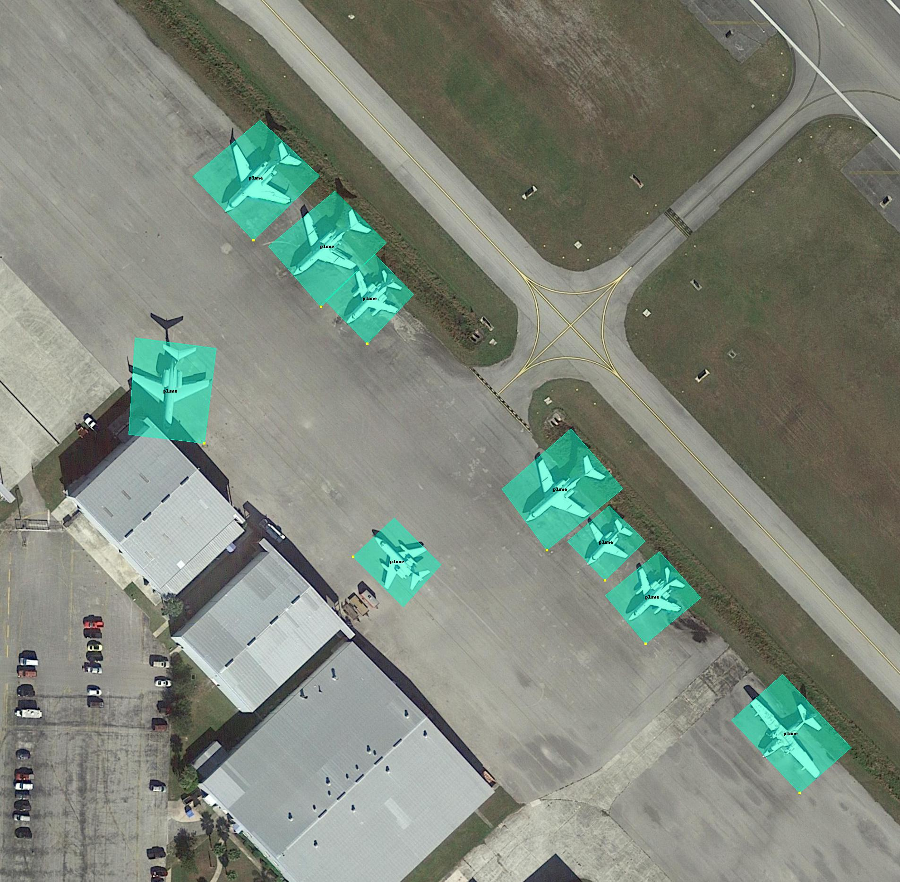
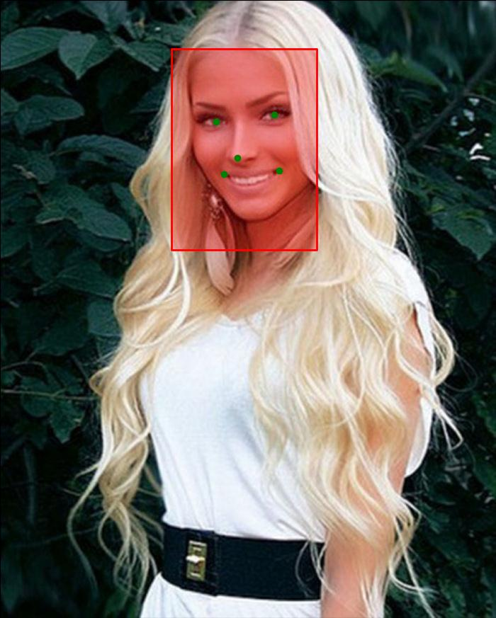

# Коннектор для работы с популярными датасетами

Коннектор может быть использован для подключения к датасетам, предназначенным для:
- задачи локализации (на данный момент реализовано полнофункциональное подключение
к датасетам в форматах DOTA и PASCALVOC);
- задачи поиска структурных изменений на разновременных изображениях (на данный момент реализован базовый
функционал к датасету в формате CD2014).


Объект ```LocalisationDatasetConnector``` позволяет:
- осуществлять выборку данных заданного набора классов;
- выбирать данные для заданного подмножества изображений;
- фильтровать данные разметки по размеру изображений;
- конвертировать данные в формат разметки COCO;
- вычислять описательную статистику для любого среза данных;
- визуализировать срез данных для заданного изображения.

Объект ```ChangeDetectionDatasetConnector``` позволяет:
- выбирать данные для заданного подмножества изображений;
- вычислять описательную статистику для любого среза данных;
- визуализировать срез данных для заданной группы.

## 1. Installation
``` python setup.py install```

## 2. Examples
#### 2.1 DOTA dataset workflow example
```python
import os
import matplotlib.pyplot as plt

from connector.dota import DOTADatasetConnector

root_dir = r'/path/to/dataset/dota/train'

# connector: connect to source dataset
conn = DOTADatasetConnector.connect(imagedir=os.path.join(root_dir, 'images'),
                                    labeldir=os.path.join(root_dir, 'labelTxt'))

# select custom label set
labels = ['plane', 'roundabout', 'storage-tank']
selected_labels = conn.select_labels(labels=labels)

# select objects with width in (10, 300)px and height in (10, 300)px. 
selected_objects = selected_labels.select_objects(width=(10, 300), height=(10, 300))

# show dataset annotation info (or save it to filename)
selected_objects.describe(filename=None)

# draw annotation of 'P0178.png' in custom dataset slice.
image_with_annotation = selected_objects.draw_image_annotation(image_file='/path/to/dataset/dota/train/images/P0178.png')
plt.imsave('dota.jpg', image_with_annotation)
```


#### 2.2 PASCAL VOC dataset workflow example

```python
from connector.pascalvoc import PASCALVOCDatasetConnector

# connector: connect to source dataset
root_dir = '/path/to/dataset/pascalvoc-like'
new_dataset_dir = '/path/to/dataset/pascalvoc-like/custom'
conn = PASCALVOCDatasetConnector.connect(imagedir=root_dir,
                                         labeldir=root_dir)

# select custom label set
# select objects with width in (10, 300)px and height in (10, 300)px. 
labels = ['class 1', 'class 2']
data = conn.select_labels(labels=labels).select_objects(width=(10, 300), height=(10, 300))

# show dataset annotation info (or save it to filename) 
data.describe(filename=None)

# convert selected data with sliding window patches of shape (512х512) and overlapped with 0.5 x (height, widht)
# save new data to 'new_dataset_dir'
data.convert(patch_shape=(512, 512), imagedir=new_dataset_dir, labeldir=new_dataset_dir, rel_shift=0.5)

# connector: connect to new dataset
converted_dataset = PASCALVOCDatasetConnector.connect(imagedir=new_dataset_dir, labeldir=new_dataset_dir)

# calculate dataset mean and std values
converted_dataset.calculate_stat_coeffs(n_bootstrap=100, filename="stat.coeffs")

# convert annotation into COCO(json-like) format and save to jsonfile.
converted_dataset.create_coco_format_annotation(jsonfile="coco_format.json")

```
#### 2.3 CD2014 dataset workflow example
```python
import os.path as path
from connector.cd2014 import CDDatasetConnector

# connector: connect to  dataset
root_dir = '/path/to/dataset/cd2014'
conn = CDDatasetConnector.connect(root_dir=root_dir,
                                  filename=path.join(root_dir, "train.txt"))

# select some clusters
cluster_video = ["PTZ", "nightVideos", "cameraJitter"]
data1 = conn.select_cluster(cluster_video)

# select custom group
group_video = ["skating"]
data2 = conn.select_group(group_video)

data = data1 + data2

# describe dataset
data.describe()

print(data.calculate_stat_coeffs(n_bootsrap=100))
```

#### 2.4 CelebA dataset workflow example
```python
from connector.celeba import CelebADatasetConnector

root_folder = '/path/to/dataset/CelebA'

# use original data
conn = CelebADatasetConnector.connect(folder=root_folder, aligned=False)

# select all data for person with id `206`
person_206 = conn.select_person(idx=[206])

# visualize annotation
person_206.show(show_attributes=False)
```


```python
from connector.celeba import CelebADatasetConnector

root_folder = '/path/to/dataset/CelebA'
conn = CelebADatasetConnector.connect(folder=root_folder, aligned=True)

print(len(conn.attributes), conn.attributes)
conn.select_attributes(attributes=['Attractive', 'Black_Hair']).show(show_attributes=False)
```

